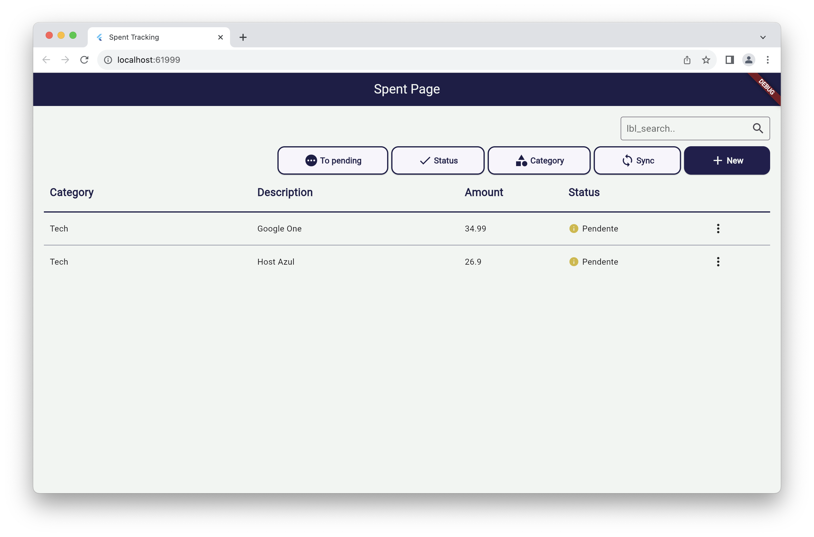

# Spent Tracking

Track your monthly spending with this tool! Record your usual expenses, organize them into categories, and update their status to plan your spending until the end of the month.



## Running the application
1. Go to /backend and run:
```bash
npm run dev
```
> This will generate documentation with TSOA for Swagger and up an API for flutter web app uses.
2. On /frontend, run `flutter pub get` to download dependencies, and run:
```bash
flutter run
```

## Technologies
### BackEnd
- [Typescript](https://www.typescriptlang.org): TypeScript is a strongly typed programming language that builds on JavaScript, giving you better tooling at any scale.
- [NodeJs](https://nodejs.org/en): Node.js® is an open-source, cross-platform JavaScript runtime environment.
- [Prisma](https://www.prisma.io): Next-generation Node.js and TypeScript ORM
- [ExpressJs](https://expressjs.com): Express provides a thin layer of fundamental web application features, without obscuring Node.js features that you know and love.
- [tsoa](https://tsoa-community.github.io/docs/): For generate docs for Swagger.

### FrontEnd
- Flutter 3.16.9
- Dart 3.2.6
